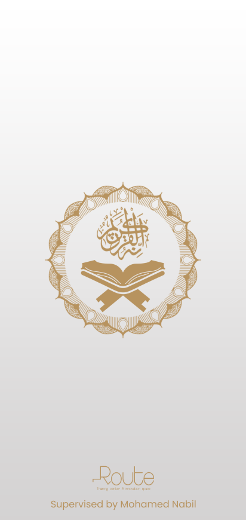
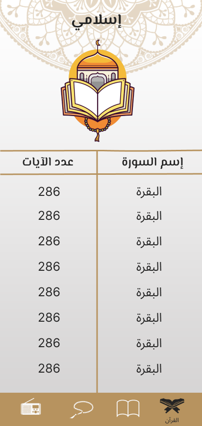
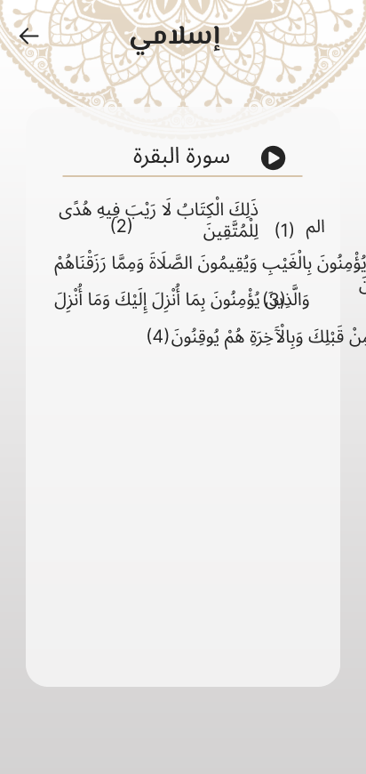
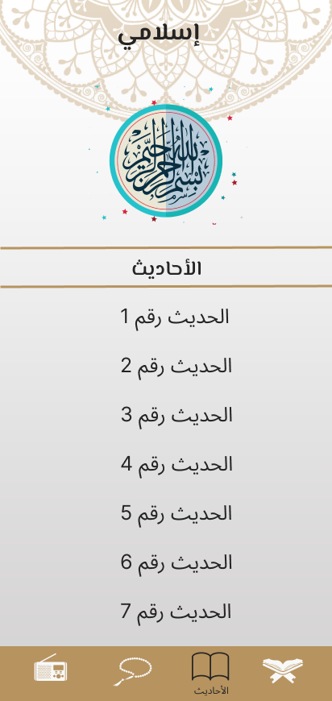
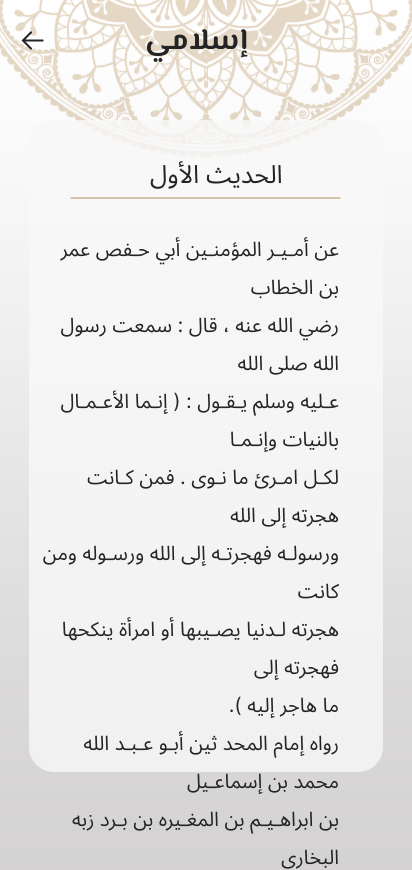
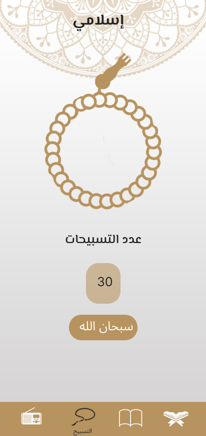
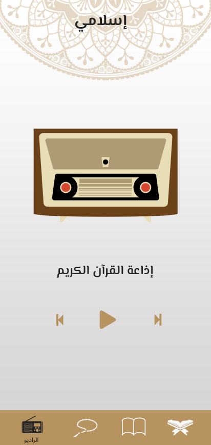

# Islami App

## 📑 Table of Contents
1. [🚀 Introduction](#-introduction)
2. [🛠 Installation & Setup](#-installation--setup)
3. [🤝 Contribution Guide](#-contribution-guide)
4. [🖥️ Technical Stack](#️-technical-stack)
5. [🎥 Demo Video](#-demo-video)
6. [🛠 Features](#-features)
7. [📷 Screenshots](#-screenshots)
8. [👥 Contributors](#-contributors)

## 🚀 Introduction
The Islami App is a comprehensive Islamic app designed to provide a seamless experience for users seeking religious content. It features Quran recitation, Hadith references, a digital Tasbeeh counter, a Quran radio, and customizable themes with support for localization.

## 🛠 Installation & Setup
To run this project locally, follow these steps:

### Prerequisites
- **Flutter SDK**: Ensure you have the Flutter SDK installed. [Download Flutter](https://flutter.dev/docs/get-started/install)
- **IDE**: Use an IDE like Android Studio, VS Code, or IntelliJ IDEA with Flutter and Dart plugins installed.
- **Device/Emulator**: A physical device or emulator to run the app.

### Steps
1. Clone the repository:
   ```bash
   git clone https://github.com/Mohammedhussein12/islami_app.git
   cd islami
   
2. Install dependencies:
   ```bash
   flutter pub get
   
3. Run the app:
   ```bash
   flutter run

## 🤝 Contribution Guide

We welcome contributions from the community! To contribute:

1. Fork the repository.

2. Create a new branch for your feature:
   ```bash
   git checkout -b your-feature-branch
   
3. Make your changes and commit:
   ```bash
   git commit -m "Add a detailed commit message"
   
4. Push your branch:
   ```bash
    git push origin your-feature-branch
   
5. Create a pull request:

## 🖥️ Technical Stack

This project utilizes the following technologies and packages to deliver an enriched Islamic experience:

### **Core Technologies**
- **Flutter**: The primary framework for building the app.
- **Dart**: The programming language used with Flutter.

### **UI & UX**
- **MediaQuery**: Ensures the app is responsive across different screen sizes.
- **google_fonts**: Custom fonts for enhancing the user interface.

### **State Management**
- **provider**: A simple and efficient state management solution.

### **Themes and Localization**
- **shared_preferences**: Saves user preferences, such as selected theme (light/dark mode) and language.
- **flutter_localizations**: Provides localization support for multiple languages.
- **intl**: Enables internationalization for date, time, and text formatting.

### **Networking**
- **http**: Handles API requests for fetching data efficiently.

### **Audio Playback**
- **just_audio**: Provides seamless audio playback for the Quran radio feature.

## 🎥 Demo Video

Watch the demo video to see the application in action: [Demo Video Link](https://drive.google.com/file/d/1wDOX7UghzkLGCnjDPHIVnn47IQibESKK/view?usp=drive_link)

## 🛠 Features

### 🕌 Islamic Content
- **Quran**: Browse surahs with details like the number of verses.
- **Hadith**: Access a collection of Hadiths for spiritual guidance.
- **Tasbeeh Counter**: Digital Tasbeeh for easy dhikr counting.
- **Quran Radio**: Listen to Quran recitations seamlessly using the `just_audio` package.

### 🎨 Customization
- **Dark Mode & Light Mode**: Switch between themes based on user preference.
- **Localization**: Supports multiple languages for accessibility with the `intl` package.

### 📱 User-Friendly Interface
- Responsive design powered by **MediaQuery** for screen adaptability.
- Smooth navigation with a tab-based design.
- Custom fonts for a polished and consistent UI using `google_fonts`.

## 📷 Screenshots

| Splash | Quran                                             | Sura Content                                           |
|------------------------------|---------------------------------------------------|--------------------------------------------------------|
|  |  |  |

| Hadeth                                              | Hadeth Content                                                      | Sebha                                             |
|-----------------------------------------------------|---------------------------------------------------------------------|---------------------------------------------------|
|  |  |  |

| Radio                                             |
|---------------------------------------------------|
|  |

## 👥 Contributors
- **Mohammed Hussein** ([Mohammedhussein12](https://github.com/Mohammedhussein12))

